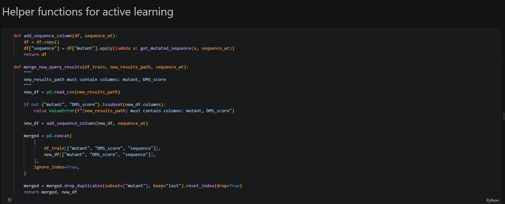
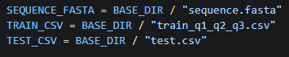
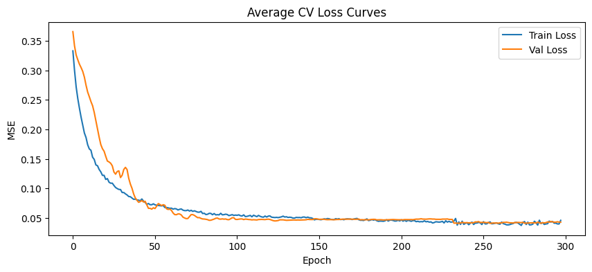
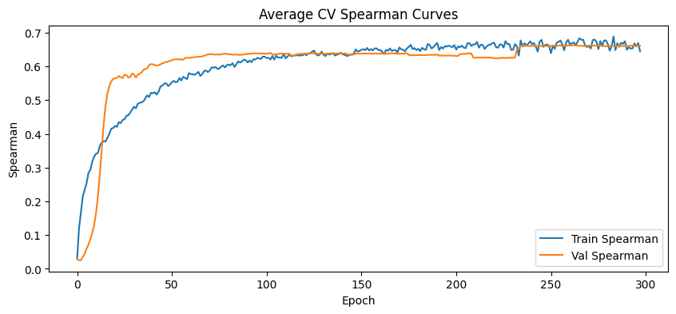

To run the latest version of the code, follow the steps below:

* Install the dependencies in requirements.txt. 
* Open the file Active_learning/Active_Learning_new.ipynb.
* The file train_q1_q2_q3.csv contains the original 1140-data-point training set combined with the results from queries 1–3. You can run the code as-is, using this final version of the training data, ignoring the results from the section "Helper functions for active learning" and below:

You can also replace "train_q1_q2_q3.csv" with "train.csv" (the string specifying the original 1140-data-point file) in the code snippet below:

.

* This will cause the code to iteratively add in the 3 queries, simulating the original active learning process.
* The training and validation loss and Spearman R values, respectively, are plotted with respect to the average over all cross-validation folds in Cell 10:

* The test set and top 10 predictions are saved to the folder Active_learning/outputs as predictions.csv and top10.txt, respectively.